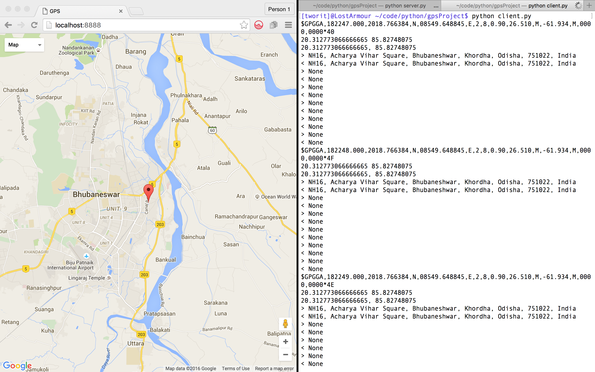

Location finder using gps module. :smiley:

This is built on Python 3.5 asyncio, websockets and tornado.

Here the GPS Module SKG13C has been used. The drivers can be found at [here](http://plugable.com/drivers/prolific/) for different OSes.

After connecting the GPS module we can see the port address of the module as something like 
``` 
/dev/ttyUSB0 
```
in Linux and as 
```
/dev/tty.usbserial
```
in Mac OSX.

Accordingly change the port address in  ``` client.py  ```. 

install the required libraries of python 3.5 as mentioned below.

```shell
pip3.5 install tornado

pip3.5 install geopy

pip3.5 install websockets

pip3.5 install pyserial

pip3.5 install asyncio
```

It's better to install python 3.5 for the project using [pyenv](https://github.com/yyuu/pyenv
).

Run the server.

```shell

python server.py

```

Then, run the gps client to retrieve the address.

```

python client.py

```

The location can be seen in any browser over google maps. 

```

http://localhost:8888/

```



Give it a go. :smiley:

``` read.py ``` is given to test the GPS module only.

Made with :heart: by [Chinmaya Das](https://github.com/chinmaydas96/) and [Tworit](https://github.com/tworitdash/)


